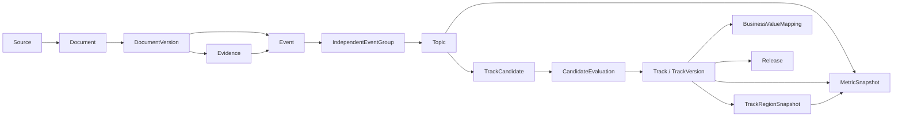

# 政策与行业信号监测及赛道洞察系统技术实现方案 V0.1

## 一、文档目的

本文给出面向联想 SMB 的“政策与行业信号监测及赛道洞察”POC 技术实现方案，覆盖系统结构、技术选型、数据模型、采集与处理流程、事件及主题算法、赛道生成、变化检测、SMB 经营价值映射、发布契约、测试验收和部署运行。

本方案用于指导第一部分“赛道洞察”系统建设。系统持续采集明确范围内的政策、申报、名单、项目、采购、统计和行业材料，形成可追溯的事件、主题、赛道及区域洞察。后续客户标签项目只消费本系统发布的版本化赛道注册表，不读取中间分析状态。

## 二、已确定的实现原则

1. 系统采用工程化批处理管道，不以 Agent 或逐文档大模型调用作为主执行方式。
2. 原始材料、标准化文档、事实事件、主题分析、赛道结论和业务判断分层保存。
3. 所有正式结论可以回溯到 DocumentVersion 和具体 Evidence。
4. Topic 是观察对象；Track 是通过业务验证的稳定对象。
5. Track 由程序自动分析和生成，不设置人工审批前置条件；人工可以编辑和修订结果。
6. POC 的时间统计统一使用文档发布时间。
7. 来源缺失、采集失败和解析失败不得作为零信号参与降温判断。
8. POC 采用单机部署的模块化单体和持久化批处理管道。
9. 模型结果必须经过结构校验、引用校验、证据校验和业务规则校验后才能成为正式对象。
10. 由于不存在权威赛道分类和企业赛道标签，POC 采用人工审核而非监督标签准确率进行评估。

## 三、总体架构

### 3.1 逻辑架构

```text
来源配置与适配器
        ↓
来源发现与周期观测
        ↓
页面、附件与响应原始存储
        ↓
Document / DocumentVersion 标准化
        ↓
精确去重、近似去重与转载识别
        ↓
实体、Event 与 Evidence 抽取
        ↓
IndependentEventGroup 归并
        ↓
已知 Topic 匹配
        ↓
剩余事件聚类与未知 Topic 发现
        ↓
Topic 合并、拆分与候选赛道形成
        ↓
变化指标与区域指标计算
        ↓
四类硬门槛自动验证
        ↓
Track / TrackRegionSnapshot
        ↓
SMB 经营价值映射与评估
        ↓
赛道注册表、周期洞察和质量报告
```

### 3.2 核心对象关系



### 3.3 POC 部署拓扑

```text
┌─────────────────────────────────────────────┐
│ 单机 Docker Compose                         │
│                                             │
│  API 服务       Scheduler       Worker      │
│      │              │              │         │
│      └──────────────┴──────────────┘         │
│                     │                        │
│            PostgreSQL + pgvector             │
│                     │                        │
│          本地内容寻址 Blob 存储卷            │
│                                             │
│  可选：本地 Embedding 服务或外部模型接口     │
└─────────────────────────────────────────────┘
```

API、Scheduler 和 Worker 使用同一代码库与领域模型，以不同进程入口运行。原始对象通过统一 BlobStore 接口访问，POC 使用本地磁盘实现，后续可以切换为 S3 兼容对象存储而不修改业务代码。

## 四、技术选型

| 层次 | POC 选型 | 用途 |
|---|---|---|
| 开发语言 | Python 3.12+ | 采集、解析、算法、模型编排和 API |
| API 与数据校验 | FastAPI、Pydantic | 内部管理接口、查询接口和结构化 Schema 校验 |
| 数据访问与迁移 | SQLAlchemy 2、Alembic | 数据访问、事务和数据库版本迁移 |
| 关系数据库 | PostgreSQL 17+ | 元数据、业务对象、任务、版本和引用关系 |
| 文本相似检索 | PostgreSQL `pg_trgm` | 标题、机构、项目和实体名称的近似匹配 |
| 向量检索 | PostgreSQL `pgvector` | Event、Topic 和 Track 的语义相似检索 |
| 原始对象存储 | 本地内容寻址 BlobStore | HTML、附件、响应体、解析中间文件和发布包 |
| HTTP 采集 | HTTPX | HTTP 请求、连接池、超时和重试控制 |
| HTML 解析 | Trafilatura、lxml | 正文提取及站点特例解析 |
| 附件解析 | pypdf、python-docx、openpyxl | PDF、Word 和 Excel 内容解析 |
| OCR | 可插拔 OCR 处理器 | 仅处理扫描件，结果单独标记质量 |
| 向量模型 | BGE-M3 作为默认候选 | 中文及多语言 Event 和 Topic 向量，模型可替换 |
| 聚类 | scikit-learn 层次聚类 | 未知 Topic 的确定性聚类初版 |
| 测试 | pytest | 单元、集成、回归和数据契约测试 |
| 部署 | Docker Compose | 单机可重复部署 |

POC 不单独引入 Redis、Elasticsearch、图数据库和分布式工作流系统。PostgreSQL 同时承担持久化任务队列、结构化查询、文本近似检索和向量索引；当规模验证表明存在明确瓶颈时再拆分组件。

所有依赖在 `pyproject.toml` 中声明并生成锁文件。部署镜像、解析器、规则、提示词和模型均固定版本。

## 五、代码结构

```text
src/track_insight/
  api/                    # FastAPI 路由和请求响应 Schema
  domain/                 # 领域对象、枚举、状态机和业务规则
  repositories/           # 数据访问接口及 PostgreSQL 实现
  blobstore/              # 原始对象存储接口及本地实现
  sources/                # 来源配置、适配器协议和站点适配器
  collectors/             # URL 发现、下载、限流和抓取状态
  parsers/                # HTML、PDF、Word、Excel、OCR 解析器
  normalization/          # URL、文本、日期、地区和机构规范化
  deduplication/          # 文档、转载和独立事件去重
  entities/               # 实体抽取、别名和归一
  events/                 # Event 抽取、校验和分组
  topics/                 # 已知匹配、聚类、合并和拆分
  tracks/                 # 候选生成、四门槛验证和生命周期
  metrics/                # 时间窗口、归一化和变化状态
  smb/                    # IT 需求分类、映射表和 SMB 评估
  models/                 # LLM 与 Embedding Provider 接口
  publishing/             # 注册表、洞察和质量报告发布
  jobs/                   # Scheduler、Worker 和任务处理器
  quality/                # 质量指标、覆盖审计和人工审核记录
  config/                 # 配置加载及版本指纹
  cli/                    # 回采、增量运行、重算和发布命令
migrations/               # Alembic 数据库迁移
config/
  sources/                # 来源配置
  rules/                  # 抽取、匹配和变化规则
  taxonomies/             # Event、Topic、地区和 IT 需求分类
  prompts/                # 大模型提示词和输出 Schema
tests/
  unit/
  integration/
  contracts/
  fixtures/
deploy/
  compose.yaml
  env.example
```

各模块通过领域接口交互，不直接读取其他模块的内部表。批处理器接收对象 ID 和处理版本，不传递整批内存状态。

## 六、通用数据约定

### 6.1 ID 与版本

- 内部对象主键使用 UUID。
- Source、Topic 和 Track 另有稳定业务代码，如 `source_miit`、`topic_machine_vision` 和 `track_industrial_visual_inspection`。
- 原始对象和已发布版本不可覆盖。
- 派生对象记录 `input_fingerprint`、`processor_version`、`rule_version`、`model_version` 和 `created_at`。
- 人工修订形成新 revision，不修改生成版本。
- 所有时间保存带时区时间戳，默认展示时区为 `Asia/Shanghai`。

### 6.2 内容指纹

- 二进制对象：SHA-256。
- 标准化正文：移除模板噪声、规范空白后计算 SHA-256。
- 近似正文：计算 SimHash，用于候选去重。
- 配置指纹：对规范化后的配置 JSON 计算 SHA-256。
- 模型调用指纹：对任务类型、规范化输入、Prompt 版本、模型和参数计算 SHA-256。

### 6.3 枚举管理

稳定枚举在代码和数据库检查约束中双重定义。可运营分类通过版本化配置表管理。模型不得直接创造新的正式枚举值；未知值进入 `unknown` 并保留模型原始输出。

## 七、核心数据模型

### 7.1 来源与采集

#### Source

| 字段 | 说明 |
|---|---|
| `id`、`source_code`、`name` | 稳定标识和名称 |
| `publisher`、`source_level`、`source_type` | 发布机构、等级和类型 |
| `regions`、`content_types` | 计划覆盖范围 |
| `entry_urls`、`adapter_key` | 入口和适配器 |
| `schedule`、`rate_limit`、`retry_policy` | 运行配置 |
| `evidence_usage`、`usage_restrictions` | 证据用途和使用限制 |
| `config_version`、`enabled` | 配置版本和启用状态 |

#### CrawlRun

记录一次来源发现或抓取运行，包括计划时间、开始结束时间、发现数量、成功数量、失败数量、游标、水位线和运行状态。

#### SourceObservation

记录一个来源在一个统计周期内是否被有效观测。状态至少包括：

- `healthy_no_new`：正常采集且无新增；
- `healthy_with_new`：正常采集且有新增；
- `collection_failed`：发现或下载失败；
- `parse_failed`：材料获取成功但无法解析；
- `late_discovery`：历史材料延迟发现；
- `source_changed`：来源结构或发布机制变化；
- `disabled`：按配置停用。

该表是变化检测的数据完整性入口。失败状态不能按零信号计算。

### 7.2 原始材料与标准文档

#### RawObject

保存 BlobStore 对象引用、SHA-256、MIME、字节数、原始 URL、HTTP 状态、响应头、抓取时间和访问状态。BlobStore 路径采用：

```text
sha256/{hash前2位}/{完整hash}
```

#### Document

表示稳定逻辑文档。使用规范 URL、发布机构、文号和标题辅助确定身份。

#### DocumentVersion

表示文档的具体版本，包含：

- `document_id`、`version_no`；
- 标题、发布机构、文号、发布时间和地区；
- 正文、语言、内容类型和解析质量；
- 原始对象及附件对象引用；
- 正文哈希、近似哈希和规范 URL；
- 首次发现时间、抓取时间和解析时间；
- 解析器、解析器版本和解析状态。

同一规范 URL 内容变化时新增 DocumentVersion。不同 URL 的相同内容建立 DocumentRelation，不复制分析结果。

#### DocumentRelation

关系类型包括 `exact_duplicate`、`near_duplicate`、`repost_of`、`attachment_of`、`supersedes` 和 `references`。

### 7.3 Evidence

Evidence 连接 DocumentVersion 与 Event 字段或分析结论，字段包括：

- `document_version_id`；
- `target_type`、`target_id`、`target_field`；
- `evidence_type`：直接支持、部分支持、间接推断、冲突或背景；
- `quote_text`；
- `char_start`、`char_end`；
- `page_no`、`sheet_name`、`row_no`、`cell_range`；
- `quality`、`confidence`。

正式 Track 的定义、边界、区域和 SMB 判断必须至少有一条可定位 Evidence 或明确标记为推断。

### 7.4 Entity 与别名

Entity 类型至少包括政府机构、企业、园区、项目、产品、技术、应用、资质和行政区划。EntityAlias 保存规范名、别名、历史名、来源和匹配状态。

POC 实体归一顺序：

1. 统一社会信用代码、文号或标准行政区划代码等确定性标识；
2. 规范名称精确匹配；
3. 名称 trigram 相似度加地区、机构类型约束；
4. 向量或模型提出候选；
5. 低置信对象保持独立，不强制合并。

### 7.5 Event

Event 表示从 DocumentVersion 抽取的现实动作或统计事实。公共字段包括：

| 字段 | 说明 |
|---|---|
| `event_type`、`event_stage` | 类型和阶段 |
| `summary`、`action` | 规范摘要和动作 |
| `region_codes` | 影响或发生地区 |
| `document_publish_time` | POC 统计时间 |
| `amounts`、`quantities` | 金额、数值、单位和口径 |
| `confidence` | 抽取置信度 |
| `extractor_type`、`extractor_version` | 规则、模型和版本 |

EventEntity 保存主体、对象、受益方、实施方、供应方、采购方、园区和项目等角色。

POC Event 类型为：

| 类型 | 阶段或子类型 |
|---|---|
| `policy_measure` | 发布、修订、废止、支持、限制 |
| `application_program` | 征集、开放申报、截止、延期 |
| `recognition_result` | 入选、认定、授牌、撤销 |
| `project_progress` | 签约、开工、建设、投产、扩建、停建 |
| `procurement_activity` | 意向、招标、中标、合同 |
| `investment_financing` | 基金设立、投资、融资、并购 |
| `business_operation` | 产品发布、产能、订单、商业部署 |
| `standard_release` | 立项、征求意见、发布、实施 |
| `statistical_observation` | 指标、统计期、数值和单位 |

Document 内容类型和 Event 类型分别保存。一篇 Document 可以产生多个 Event。

### 7.6 IndependentEventGroup

表示同一现实发生事项对应的独立信号。字段包括规范事件摘要、核心主体、对象、事件类型、阶段、地区、时间范围、代表 Event 和分组置信度。

EventGroupMember 保存每个 Event 的归组分数和依据。EventRelation 连接同一项目不同阶段的事件组，关系包括 `precedes`、`follows`、`same_project`、`implements` 和 `related`。

统计独立事件数量时计算 IndependentEventGroup，不计算原始 Event 或 Document 数量。

### 7.7 Topic

Topic 保存：

- 稳定 Topic 代码及版本；
- 名称、定义、同义词和排除词；
- 上下位 Topic；
- 核心技术、产品、应用、实体、经营活动和产业链角色；
- 向量、向量模型和聚类版本；
- 状态：`provisional`、`active`、`merged`、`split`、`inactive`；
- 来源 Topic 的合并、拆分映射。

TopicEventGroup 保存 Topic 与 IndependentEventGroup 的关系、匹配方式、匹配分数和主次关系。同一事件组可以关联多个 Topic，但同一 Document 对同一 Topic 的相关信号数最多计一次。

### 7.8 TrackCandidate 与 CandidateEvaluation

TrackCandidate 保存一个或多个 Topic 形成的候选，包括建议名称、初步定义、企业活动、产业链角色、区域、IT 需求草案和支持事件。

CandidateEvaluation 分别保存四类硬门槛：

1. `signal_gate`：独立来源、持续性或多 Event 类型；
2. `boundary_gate`：纳入、排除和相邻赛道；
3. `enterprise_set_gate`：企业活动、可观察特征和产业链角色；
4. `business_value_gate`：标准化 IT 需求和 SMB 覆盖路径。

每个门槛保存 `passed`、指标、Evidence、模型说明、规则版本和置信度。四项全部通过后，程序自动把候选状态改为 `accepted` 并创建或更新 Track。

### 7.9 Track 与 TrackVersion

Track 保存稳定身份和生命周期；TrackVersion 保存每次可发布定义：

- 名称、定义、纳入和排除边界；
- 上下位赛道及相邻 Topic；
- 企业经营活动、可观察特征和产业链角色；
- 技术、产品、应用、资质、园区、关键词和实体；
- 支持 EventGroup 与 Evidence；
- SMB 评估、置信度、未知项和争议项；
- 生成版本、人工修订版本和有效期。

Track 生命周期为 `selected`、`cooling` 和 `archived`。名称调整不改变 Track ID；实质性拆分和合并创建新 Track，并保存 `split_from`、`merged_from` 或 `supersedes` 映射。

### 7.10 TrackRegionSnapshot

每条记录表示一个 TrackVersion 在某区域、某时间窗口的影响：

- `region_code`、`region_name`；
- `region_roles`：`major`、`hot`，可以同时具备；
- 影响依据和直接信号；
- 活动状态、区域状态和热度；
- 归一化信号、独立事件、来源和来源类型；
- 区域 SMB 条件；
- 数据完整度和置信度。

只记录有证据支持的主要或热门区域，不穷举全部理论影响区域。没有当地直接政策或新闻时，可以依据企业集群、产业基础或项目分布纳入，但必须明确直接信号为空及其替代依据。

### 7.11 MetricSnapshot

记录 Topic、Track 或 TrackRegionSnapshot 在时间窗口内的原始计数、归一化结果、比较基线、来源集合、完整度和状态结论。MetricSnapshot 一经用于发布不可修改；迟到数据或规则变化产生新计算版本。

### 7.12 SMB 经营价值

#### ITNeedCategory

POC 通用分类包括：

1. 办公与协同终端；
2. 研发设计与专业工作站；
3. 计算与 AI；
4. 存储与备份；
5. 网络连接；
6. 信息安全；
7. 现场与边缘计算；
8. 运维服务。

#### BusinessValueMapping

字段包括 TrackVersion、企业角色、经营活动、需求类别、触发原因、标准化程度、可复制程度、联想能力类别、Evidence、推断说明、置信度、生成方式和版本。

映射初版由模型生成，经过 Schema 和引用检查后保存。人工修订产生新 revision。缺少联想能力资料时使用“信息不足”或“待确认”，不由模型生成确定产品结论。

### 7.13 运行与发布对象

#### Job

保存任务类型、对象 ID、幂等键、输入指纹、优先级、状态、尝试次数、计划时间、租约、错误和输出引用。

#### ModelInvocation

保存模型任务、输入输出指纹、Provider、模型、参数、Token、耗时、费用、状态和结果对象，不保存未脱敏密钥。

#### ResultRevision

保存机器生成值、当前有效值、JSON Patch、修订人、修订原因、修订时间和基于版本。当前 POC 提供 API 和数据结构，后续看板通过该接口实现可视化编辑。

#### Release

固定数据截止时间、来源配置版本、处理版本、规则版本、模型版本、TrackVersion 集合、质量状态和发布文件清单。

## 八、来源适配器与采集

### 8.1 SourceAdapter 协议

```python
class SourceAdapter(Protocol):
    def discover(self, source, cursor) -> DiscoveryBatch: ...
    def fetch(self, item) -> FetchResult: ...
    def next_cursor(self, batch) -> dict | None: ...
    def healthcheck(self, source) -> HealthResult: ...
```

DiscoveryItem 至少包含候选 URL、父页面、标题提示、发布时间提示、附件提示和发现来源。通用下载器负责 HTTP；适配器不得直接写业务表。

### 8.2 采集顺序

1. Scheduler 根据 Source 配置创建 `source_discover` Job。
2. Worker 调用适配器发现 URL，并写入 DiscoveryItem。
3. URL 规范化后生成下载幂等键。
4. 下载页面和附件，写入 RawObject。
5. 创建或更新 Document、DocumentVersion。
6. 写入 SourceObservation 和 CrawlRun 指标。
7. 对新增 DocumentVersion 创建解析 Job。

### 8.3 URL 与下载规则

- 移除追踪参数和无业务意义的 fragment；
- 保留改变正文内容的查询参数；
- 尊重来源配置的限流、允许时间和使用限制；
- 使用 ETag、Last-Modified 和内容哈希减少重复下载；
- 超时、429、5xx 和解析失败分别记录；
- 附件 URL 与父页面建立关系；
- 不因单一附件失败使整篇文档失败。

### 8.4 历史回采与增量

历史回采按来源、月份和分页范围切分 Job，增量任务按来源水位线运行。回采材料按原始发布时间进入历史窗口，并记录 `late_discovery`，不得进入当前新增统计。

## 九、持久化任务管道

### 9.1 任务状态

```text
pending → running → succeeded
              ├──→ retry_wait → pending
              ├──→ failed
              └──→ needs_review
```

Worker 使用 PostgreSQL 行锁领取任务：按优先级选择 `pending` 且到期的记录，通过 `FOR UPDATE SKIP LOCKED` 避免多个 Worker 重复领取。任务设置租约；Worker 异常退出后，过期租约由回收任务重新置为 `pending`。

### 9.2 幂等键

```text
job_type + object_id + input_fingerprint + processor_version
```

数据库对幂等键建立唯一约束。重复调度返回已有 Job。成功结果按输入指纹缓存；版本变化只使受影响的派生任务失效。

### 9.3 任务类型

- `source_discover`
- `document_fetch`
- `document_parse`
- `document_deduplicate`
- `entity_extract`
- `event_extract`
- `event_group`
- `embedding_generate`
- `topic_match`
- `residual_cluster`
- `topic_reconcile`
- `metric_compute`
- `track_candidate_generate`
- `track_validate`
- `smb_mapping_generate`
- `region_snapshot_generate`
- `release_build`
- `quality_audit`

### 9.4 失败隔离

一个 Job 只处理一个最小对象或一个有限批次。批次中单对象失败写入独立错误记录，其余对象继续。重试次数、退避和不可重试错误由任务类型配置。

## 十、文档解析、标准化与去重

### 10.1 解析流程

1. MIME 和实际文件签名识别；
2. HTML 正文、标题、机构和发布时间提取；
3. PDF、Word 和 Excel 结构提取；
4. 扫描件进入 OCR 分支；
5. 文本清洗、段落和表格位置保留；
6. 日期、地区、文号、金额和数量规则抽取；
7. 解析质量评分；
8. 保存标准正文和定位映射。

解析后的每段文本保留段落编号、字符偏移和来源页码，使后续 Evidence 能回到原始位置。OCR 文本保存 OCR 引擎、置信度和页面图像引用，低质量 OCR 不单独支持关键事实。

### 10.2 去重层次

1. 相同二进制 SHA-256：原始对象重复；
2. 相同标准正文 SHA-256：DocumentVersion 内容重复；
3. SimHash、标题相似度、机构和发布时间：近似重复候选；
4. 原文链接、发布机构和文号：转载与原始来源关联；
5. Event 层主体、动作、阶段、区域和时间：IndependentEventGroup 合并。

Document 去重不直接删除对象，只建立关系并选择代表版本。正式统计分别使用 Document 数量和 IndependentEventGroup 数量。

## 十一、实体、Event 与 Evidence 抽取

### 11.1 处理顺序

```text
规则字段抽取
→ 实体候选识别
→ 实体归一
→ Event 候选抽取
→ 高价值或低置信候选调用模型
→ Pydantic Schema 校验
→ Evidence 定位校验
→ Event 入库
→ IndependentEventGroup 归并
```

### 11.2 确定性抽取优先

规则优先处理发布日期、文号、地区、机构、金额、数量、名单、项目阶段、采购状态和统计单位。模型只处理复杂措施、模糊主体对象、跨段落事件和语义冲突。

### 11.3 Event 分组分数

初始分组分数由以下特征组成，权重配置化：

- 规范主体和对象一致；
- Event 类型和阶段一致；
- 项目、政策或采购名称相似；
- 地区一致或存在上下级关系；
- 发布时间接近；
- 正文语义向量相似；
- 是否引用同一原始页面或文号。

高置信自动合并，中间置信保留候选关系，低置信不合并。不同阶段永不因名称相同而直接合并为一个独立事件组。

## 十二、Topic 发现与维护

### 12.1 Topic 特征

每个 EventGroup 生成用于主题处理的特征包：

- 事件规范摘要向量；
- 技术、产品、应用和资质词；
- 企业经营活动和产业链角色；
- 核心实体；
- Event 类型；
- 地区；
- 发布时间窗口。

### 12.2 已知 Topic 匹配

匹配顺序：

1. Topic 同义词、排除词和实体规则；
2. EventGroup 向量与 Topic 向量的余弦相似度；
3. 经营活动、产业链角色、关键词和实体重合；
4. 排除边界冲突检查。

初始综合分数建议为：向量相似度 55%、经营活动及角色重合 25%、关键词和实体重合 20%。高阈值自动关联；中间区间允许多 Topic 关联；低于阈值进入剩余事件池。具体阈值存入配置并通过人工审核样本调整。

### 12.3 未知 Topic 聚类

POC 使用最近 90 天和历史剩余事件池，以事件摘要向量为主特征，采用余弦距离的层次聚类和距离阈值，不预设聚类数量。经营活动、角色和实体重合作为聚类后校验条件。

聚类至少有两个 IndependentEventGroup 才创建 `provisional` Topic。单事件作为临时线索保存。模型接收压缩后的代表事件、关键词、实体和时间分布，生成 Topic 名称、定义、同义词和边界草案。

### 12.4 合并规则

同时满足以下条件时自动提出合并：

- 企业经营活动和主要产业链角色一致；
- 事件、实体或关键词明显重合；
- 无法形成稳定排除边界；
- IT 需求没有实质差异。

程序使用规则和模型共同生成合并决定，保存输入 Topic、分数、理由、规则及模型版本。合并后保留原 Topic 到新版本的映射。

### 12.5 拆分规则

同时满足以下条件时提出拆分：

- Topic 内存在持续稳定的两个或多个事件子群；
- 子群经营活动、角色或 IT 需求存在实质差异；
- 每个子群至少有两个独立事件；
- 每个子群可以形成明确边界。

地域不同和一次聚类变化不能单独触发拆分。

## 十三、候选赛道与 Track 自动生成

### 13.1 候选进入条件

POC 默认条件：

- 不少于三个 IndependentEventGroup；
- 不少于两个独立 Source；
- 至少两种 Event 类型，或信号出现在至少两个时间窗口；
- 可以初步描述企业经营活动和产业链角色；
- 可以生成第一版 SMB 经营价值映射。

阈值全部配置化。一个候选可以来源于一个 Topic 或多个互补 Topic。

### 13.2 四类硬门槛

#### 信号成立

验证事件、来源、Event 类型和跨窗口情况，排除孤立事件、集中转载和来源异常造成的虚假信号。

#### 边界成立

必须生成定义、纳入条件、排除条件和相邻 Topic，并通过结构检查。无法形成排除边界的对象保留为 Topic。

#### 企业集合成立

必须描述至少一种企业经营活动、一种产业链角色和一组公开可观察特征。宏观概念但无法对应企业集合的对象不能成为 Track。

#### 经营价值成立

必须至少生成一条“企业角色及经营活动—IT 需求类别—标准化及可复制程度”的映射，并说明 SMB 覆盖路径。证据不足的关键字段不能以确定结论通过。

### 13.3 自动状态转换

```text
candidate
  ├── 四门槛全部通过 → accepted → Track:selected
  ├── 证据或信息暂缺 → watchlist
  └── 明确不满足     → rejected

Track:selected
  ├── 热度回落但仍有效 → cooling
  └── 定义不再有效     → archived
```

程序自动执行状态转换。人工修订不作为前置审批，但可以修改已生成结果并产生新版本。

## 十四、变化指标与状态

### 14.1 统计时间与窗口

- 统计时间统一使用 Document 发布时间；
- 最近 30 天为主要判断窗口；
- 前 30 天为上一周期；
- 过去 6 至 12 个月的 30 天窗口中位数为历史基线；
- 最近 7 天用于短期提示；
- 最近 90 天用于辅助观察持续性；
- 无可靠发布时间的材料不进入变化指标。

### 14.2 四类指标

对 Topic、Track 和区域分别计算：

1. 归一化相关信号数量；
2. IndependentEventGroup 数量；
3. 独立 Source 数量和 Source 类型数量；
4. 涉及区域数量和新增区域数量。

相关信号以不同 Document 为计数单位，同一 Document 对同一 Topic 或 Track 最多计一次。

```text
normalized_signal_rate
= 当前窗口相关 Document 数量
  / 同一可比来源集合的全部有效 Document 数量
  * 1000
```

环比只使用两个周期均正常采集的共同来源。新增来源、失败来源和发生结构变化的来源不直接参与环比。

### 14.3 完整性闸门

先计算状态，再判断是否允许输出变化结论：

- 正常采集且无新增：允许按零信号参与；
- 采集失败或解析失败：从可比来源集合排除；
- 历史材料延迟发现：按原发布时间进入历史窗口；
- 来源结构变化：该来源本期不参与环比；
- 有效可比来源不足：输出“信号不足”，禁止“热度回落”。

### 14.4 活动状态

| 状态 | POC 初始规则 |
|---|---|
| 新出现 | 历史基线无有效独立事件，当前至少有2个独立事件和2个独立来源 |
| 快速升温 | 归一化信号量达到上一周期与历史基线较高者的1.5倍以上，且独立事件至少增加2个 |
| 持续活跃 | 当前至少有2个独立事件和2个独立来源，归一化信号量不低于历史基线80%，但未达到快速升温 |
| 热度回落 | 数据完整时，归一化信号量低于历史基线50%，且独立事件至少减少2个 |
| 信号不足 | 独立事件少于2个、独立来源少于2个，或来源完整性不足 |

当历史基线和上一周期均为零时不计算倍数，直接使用“新出现”规则。所有阈值存入版本化配置。

### 14.5 区域状态

| 状态 | POC 初始规则 |
|---|---|
| 区域扩散 | 当前至少新增1个有证据支持的区域，且涉及区域总数增加 |
| 区域稳定 | 有足够区域信号，但不满足扩散条件 |
| 信号不足 | 区域证据或来源完整性不足 |

活动状态和区域状态分别保存，可以同时为“快速升温”和“区域扩散”。

### 14.6 结论置信度

- 低：只有一种来源类型；
- 中：至少两种来源类型，且核心来源可用；
- 高：来源类型多样、主要来源完整且独立事件证据充分。

变化状态表达信号活跃程度，不代表方向一定有利，也不等于采购需求增长。

## 十五、SMB 经营价值生成

### 15.1 输入

- Track 定义、边界和支持事件；
- 企业经营活动和产业链角色；
- 可观察企业特征；
- 技术、产品和应用场景；
- 通用 IT 需求分类；
- 已配置的联想 SMB 能力类别；
- 区域企业集群、园区、政策适用对象等证据。

### 15.2 模型初步生成

模型对每个 TrackVersion 生成结构化映射：

```json
{
  "enterprise_role": "设备及方案供应商",
  "business_activity": "开发并交付工业视觉质检设备",
  "it_need_category": "研发设计与专业工作站",
  "trigger_reason": "模型训练、图像处理和设备设计需要专业计算终端",
  "standardization": "medium",
  "replicability": "medium",
  "lenovo_capability_category": "workstation",
  "evidence_ids": [],
  "confidence": "medium"
}
```

模型一次只处理一个压缩后的 Track 证据包，不读取整个文档库。输出必须引用输入中的 Evidence ID；没有证据的内容标记为推断。

### 15.3 SMB 六维评估

依据 BusinessValueMapping 和区域证据分别输出：

- 中小企业基础；
- 政策可达性；
- IT 需求相关性；
- 需求可复制性；
- 区域可经营性；
- 联想适配度。

每项取值为强、中、弱或信息不足，并保存依据和不确定性。第一版不合成为不可解释的总分。

### 15.4 人工修订

人工可以修改分类、映射、说明和置信度。修订通过 ResultRevision 保存，后续看板调用相同 API。机器原始结果和所有修订历史均保留。

## 十六、大模型与向量模型集成

### 16.1 Provider 接口

```python
class LLMProvider(Protocol):
    def generate_structured(self, task, payload, schema, options) -> ModelResult: ...

class EmbeddingProvider(Protocol):
    def embed(self, texts, model_key) -> EmbeddingBatch: ...
```

业务模块不得直接调用供应商 SDK。Provider 负责鉴权、超时、重试、限流、Token 统计和原始响应归档。

### 16.2 模型任务

- 复杂 Event 抽取；
- 模糊实体和事件分组核验；
- 未知 Topic 命名和定义；
- Topic 合并、拆分建议；
- Track 定义及边界草拟；
- 四门槛中的语义判断；
- SMB 经营价值映射；
- 变化原因解释。

### 16.3 结构化输出

每类任务拥有独立 Prompt、Pydantic Schema 和版本。处理步骤：

1. 构造带 ID 的压缩证据包；
2. 请求 JSON 结构化输出；
3. 保存原始响应；
4. 规范字段和枚举；
5. 校验引用 ID 是否存在；
6. 校验关键结论是否有 Evidence；
7. 校验业务规则；
8. 成功后保存候选产物，失败则进入重试或降级。

### 16.4 缓存与预算

相同任务类型、规范输入、Prompt、模型和参数命中同一调用指纹，复用缓存。每种任务配置单批大小、最大输入字符、最大 Token、每日预算和降级策略。

Embedding 默认候选为 BGE-M3 的 1024 维向量。模型名称、维度和归一化方式存入 EmbeddingModel 表；更换模型时生成新向量版本，不覆盖旧向量和旧索引。

## 十七、查询与管理 API

### 17.1 运行接口

```text
POST /api/v1/runs/backfill
POST /api/v1/runs/incremental
POST /api/v1/runs/recompute
GET  /api/v1/runs/{run_id}
GET  /api/v1/jobs
POST /api/v1/jobs/{job_id}/retry
```

### 17.2 来源与质量

```text
GET  /api/v1/sources
GET  /api/v1/sources/{source_id}/health
GET  /api/v1/quality/coverage
GET  /api/v1/quality/runs/{run_id}
```

### 17.3 文档、事件和 Topic

```text
GET /api/v1/documents
GET /api/v1/documents/{id}/versions
GET /api/v1/events
GET /api/v1/event-groups/{id}
GET /api/v1/topics
GET /api/v1/topics/{id}/timeline
```

### 17.4 Track 与修订

```text
GET   /api/v1/track-candidates
GET   /api/v1/tracks
GET   /api/v1/tracks/{id}/versions
GET   /api/v1/tracks/{id}/regions
PATCH /api/v1/tracks/{id}/current
GET   /api/v1/tracks/{id}/revisions
```

PATCH 接收目标版本和 JSON Patch。若基础版本已变化则返回冲突，避免覆盖其他修订。当前不实现最终看板，只保证 API 和数据版本支持后续可视化编辑。

### 17.5 发布

```text
POST /api/v1/releases
GET  /api/v1/releases
GET  /api/v1/releases/{id}
GET  /api/v1/releases/{id}/artifacts/{name}
```

## 十八、发布物与数据契约

每次 Release 生成：

```text
releases/{release_id}/
  manifest.json
  track_registry.json
  track_region_snapshots.json
  periodic_insight.json
  periodic_insight.md
  source_coverage.json
  quality_report.json
```

`manifest.json` 固定：

- Release ID 和生成时间；
- 数据截止时间；
- 来源配置版本；
- Schema、规则、模型和处理器版本；
- TrackVersion 列表；
- 文件名、SHA-256 和记录数；
- 已知缺口和完整性状态。

### 18.1 Track 注册表示例

```json
{
  "track_id": "track_example",
  "version": "2026-W37.1",
  "name": "示例赛道",
  "status": "selected",
  "definition": "赛道定义",
  "inclusion": [],
  "exclusion": [],
  "roles": [],
  "observable_features": [],
  "keywords": [],
  "entities": [],
  "technologies": [],
  "products": [],
  "applications": [],
  "qualifications": [],
  "activity_status": "rising",
  "region_status": "expanding",
  "region_snapshot_ids": [],
  "smb_assessment": {},
  "business_value_mapping_ids": [],
  "supporting_event_group_ids": [],
  "evidence_ids": [],
  "confidence": "medium",
  "valid_from": "2026-09-11"
}
```

发布前执行 JSON Schema、引用完整性、枚举、重复 ID、悬空 Evidence、四门槛和完整性检查。任一 Track 失败只阻止该 Track 发布，不阻断其他有效结果；质量报告列出被排除对象。

## 十九、配置与版本管理

以下内容全部配置化并参与版本指纹：

- 来源入口、频率、限流和适配器；
- URL 规范化和页面选择器；
- Event 分类及阶段；
- 实体词典和行政区划；
- Topic 词典、同义词、排除词和匹配阈值；
- 聚类距离、最小事件数和候选门槛；
- 变化窗口、倍数和绝对数量阈值；
- IT 需求分类及联想能力类别；
- Prompt、Schema、模型和参数；
- 发布 Schema。

配置通过代码评审进入版本库。运行时加载后写入 ConfigVersion，Release 固定全部配置指纹。

## 二十、质量、审核与回归验证

### 20.1 数据管道质量

- 来源计划运行和实际运行情况；
- SourceObservation 状态分布；
- 新增页面发现数量和延迟；
- 下载、正文和附件解析结果；
- Document 版本和重复关系；
- 元数据完整度；
- Job 失败、重试和恢复情况；
- 单文档处理耗时和模型调用量。

### 20.2 人工审核样本

系统按周期生成分层审核样本：

- 不同来源和格式的 Document；
- 不同 Event 类型及低置信 Event；
- 自动合并和未合并的 IndependentEventGroup；
- 已知匹配和新建 Topic；
- Topic 合并、拆分及候选赛道；
- 自动生成的 Track、区域和 SMB 映射；
- 新出现、升温、回落和信号不足结论。

审核项包括证据是否支持、结构是否合理、边界是否可执行、重复是否正确处理、指标是否可复算和解释是否忠于数据。

### 20.3 无标签条件下的验收

业务提供的库内企业基本和工商信息没有赛道标签，不能作为正确答案。人工审核意见用于发现问题、修订结果和调整规则，不定义为永久标准分类。

每次确认的审核样本可以进入回归样本库，用于检测代码、规则或模型升级是否改变既有结果；该样本库是回归约束，不宣称覆盖全部真实赛道。

### 20.4 自动测试

- 单元测试：规范化、哈希、状态机、指标公式和门槛；
- 解析器测试：固定 HTML、PDF、Word 和 Excel 样本；
- 集成测试：Source 到 Release 的最小闭环；
- 契约测试：API、JSON Schema 和下游注册表；
- 幂等测试：相同输入重复运行不生成重复正式对象；
- 失败恢复测试：下载、解析、模型和 Worker 中断；
- 回归测试：审核样本在版本升级后的差异报告；
- 发布测试：引用、哈希、版本和文件清单完整性。

## 二十一、日志、监控与审计

所有服务输出结构化 JSON 日志，公共字段包括 `run_id`、`job_id`、`source_id`、`object_type`、`object_id`、`processor_version`、`duration_ms` 和错误码。

运行指标首先写入 PostgreSQL 质量表，并通过 API 查询。POC 至少提供：

- 运行中的 Job、积压和失败数；
- 来源最近成功时间和连续失败；
- 每阶段吞吐和耗时；
- 解析质量分布；
- 模型调用次数、Token、费用和缓存命中；
- 当前发布完整性和缺口。

人工修订、配置变更、重新计算和发布均写入 AuditLog。

## 二十二、安全与来源使用控制

- 模型密钥、数据库口令和外部服务凭证只通过环境变量或密钥文件注入，不写入数据库和日志；
- API 首版部署在受控网络，使用统一身份认证或最小 API Token；
- Source 保存访问限制、证据用途和允许的抓取策略；
- 下载器执行来源级限流、超时和 User-Agent 配置；
- 原始材料、附件和发布结果分别设置访问路径；
- 向外部模型发送内容前执行来源使用限制检查和必要脱敏；
- 发布物不包含模型密钥、内部路径和原始调试响应。

## 二十三、部署与运行

### 23.1 Compose 服务

```text
postgres    PostgreSQL + pgvector + pg_trgm
api         FastAPI 查询、管理和修订接口
scheduler   周期调度和租约回收
worker      采集、解析、算法和发布任务
```

Embedding 可以在 Worker 内运行、作为可选本地服务运行，或通过 Provider 调用外部接口。LLM 默认通过 Provider 调用已配置的模型服务。

### 23.2 数据卷

- `postgres_data`：关系数据库；
- `blob_data`：原始对象和发布文件；
- `model_cache`：可选本地模型文件。

数据库备份和 Blob 清单必须使用同一备份批次 ID。恢复后运行引用完整性检查，确保数据库中的 RawObject 均能找到对应 Blob。

### 23.3 运行命令

```text
track-insight db upgrade
track-insight source validate
track-insight run backfill --source <code> --from <date> --to <date>
track-insight run incremental
track-insight run recompute --processor <name> --version <version>
track-insight release build --as-of <timestamp>
track-insight quality report --run <run_id>
```

## 二十四、实施顺序

### 阶段 0：工程骨架与数据底座

- 建立项目结构、配置加载、数据库迁移和 BlobStore；
- 实现 Job、Scheduler、Worker、幂等和版本指纹；
- 建立 Source、Document、DocumentVersion 和 RawObject；
- 建立最小 API、日志和质量表。

完成条件：能够创建来源、运行任务、保存原始对象并重复运行而不产生重复数据。

### 阶段 1：采集、解析与历史回采

- 实现适配器协议和首批来源适配器；
- 实现 HTML 与常见附件解析；
- 实现发布时间、机构、地区和文号抽取；
- 实现文档版本、精确去重和近似去重；
- 执行首批历史回采。

完成条件：DocumentVersion 可追溯到 RawObject，来源缺失原因可区分，历史和增量可以同时运行。

### 阶段 2：Event、Evidence 和独立事件

- 建立九类 Event Schema；
- 实现规则抽取、模型补充和 Evidence 定位；
- 实现实体归一；
- 实现 IndependentEventGroup 和阶段关系；
- 建立人工审核样本输出。

完成条件：事件、证据和独立事件数量可人工复核并可重复计算。

### 阶段 3：Topic 与变化检测

- 建立 Topic 词典和向量；
- 实现已知 Topic 匹配；
- 实现剩余事件聚类、Topic 命名、合并和拆分；
- 实现四类变化指标、完整性闸门和状态规则；
- 生成 Topic 时间序列。

完成条件：能够用发布时间和历史基线生成可复算的 Topic 变化状态。

### 阶段 4：Track、区域和 SMB 评估

- 实现候选进入条件和四门槛；
- 自动生成 Track 和 TrackVersion；
- 生成 TrackRegionSnapshot；
- 模型生成初始 BusinessValueMapping；
- 实现人工修订 API 和版本记录。

完成条件：候选、观察、拒绝和正式 Track 均有完整记录，正式 Track 能回溯到 EventGroup 和 Evidence。

### 阶段 5：发布与 POC 验收

- 生成注册表、周期洞察和质量报告；
- 固定 Release Manifest 和下游 JSON Schema；
- 完成来源、事件、Topic、Track 和变化结论的人工审核；
- 验证失败恢复、重算、成本和下游字段可执行性。

完成条件：系统可以按周期从增量采集运行到可校验 Release，不依赖一次性人工整理中间数据。

## 二十五、POC 完成标准

1. 来源运行状态和失败原因可以明确区分。
2. 原始材料、DocumentVersion、Event、EventGroup、Topic、Track 和 Release 全链路可追溯。
3. 相同输入和处理版本重复运行保持幂等。
4. 转载不会增加独立事件数量，不同项目阶段不会被错误删除。
5. 已知 Topic 匹配和未知 Topic 聚类两条通道均可运行。
6. Track 自动通过四门槛生成，未通过对象保留验证记录。
7. 变化状态只使用已确认的四类指标，且来源缺失不会产生错误降温。
8. 主要和热门区域通过 TrackRegionSnapshot 单独表达。
9. 每条正式 Track 具有可编辑的 SMB 经营价值映射。
10. 人工修订产生新版本，不覆盖机器生成结果。
11. 发布包通过 Schema、引用、证据、版本和哈希检查。
12. 没有标准标签时仍能通过统一人工审核记录评估结构、证据、边界和解释质量。

## 二十六、保留为配置或后续确认的事项

以下事项不阻塞工程骨架实施：

- POC 的具体区域和来源覆盖矩阵；
- Topic 相似度、聚类距离和事件分组的数值阈值；
- 变化状态初始阈值经过首轮历史数据后的调整；
- 最终采用的 LLM Provider；
- 联想 SMB 能力分类的完整内容；
- 最终看板的页面、交互和权限设计。

这些内容均通过配置、Provider 或 ResultRevision 接口隔离，不要求修改核心对象和处理流程。

## 二十七、技术参考

- [PostgreSQL 全文检索](https://www.postgresql.org/docs/current/textsearch.html)
- [PostgreSQL pg_trgm](https://www.postgresql.org/docs/17/pgtrgm.html)
- [PostgreSQL SKIP LOCKED](https://www.postgresql.org/docs/17/sql-select.html)
- [pgvector](https://github.com/pgvector/pgvector)
- [FastAPI](https://fastapi.tiangolo.com/tutorial/)
- [SQLAlchemy 2](https://docs.sqlalchemy.org/en/20/)
- [Alembic](https://alembic.sqlalchemy.org/en/latest/)
- [scikit-learn 聚类](https://scikit-learn.org/stable/modules/clustering.html)
- [BGE-M3 模型卡](https://huggingface.co/BAAI/bge-m3)
